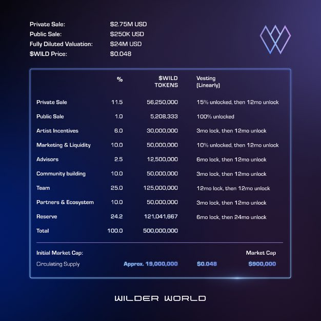

import Bleed from 'nextra-theme-docs/bleed'
import Callout from 'nextra-theme-docs/callout'

<Callout type="warning" emoji="⚠️">
  This page is provided by the community as you should use it at your own risk.
</Callout>

# Get Started

When you start with a new project it's important that you keep your resources organized.
To help with our organization and understanding of the Wilder World's vast ecosystem it's important you understand the entire scope.

## Hot Sheet

[Contract Address](https://etherscan.io/token/0x2a3bff78b79a009976eea096a51a948a3dc00e34): 0x2a3bff78b79a009976eea096a51a948a3dc00e34

1. Circulating Supply (Nov 2021) 73,683,300 **WILD**
1. Total Supply: 500,000,000 **WILD**
1. Max Supply: 500,000,000 **WILD**

<Bleed></Bleed>

## Overview

[Wilder World](https://wilderworld.com) is an Immersive 3D Universe powered entirely by NFTs.

In collaboration with Zero.Space, Wilder World enables multi-leveled, photorealistic and mixed reality worlds where Wilders roam freely, acquire virtual land and express themselves through unique avatars, decorative assets and fashionable accessories. 
Wilder World is fully owned and governed by its community — creators, players and fans alike are enabled to participate via the Wilder DAO on the Ethereum blockchain.

## Wheels

[Read more in the Wheels Section](/wheels/about)

## Kicks

[Read more in the Kicks Section](/kicks/about)

## Cribs

[Read more in the Cribs Section](/cribs/about)

## Land

[Read more in the Land Section](/land/about)

## Guild

[Read more in the Guild Section](/guild/about)

---

<Callout>
  This documentation is provided by the community, please use at your own risk
</Callout>
