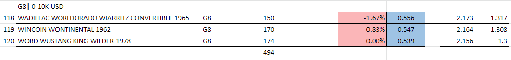
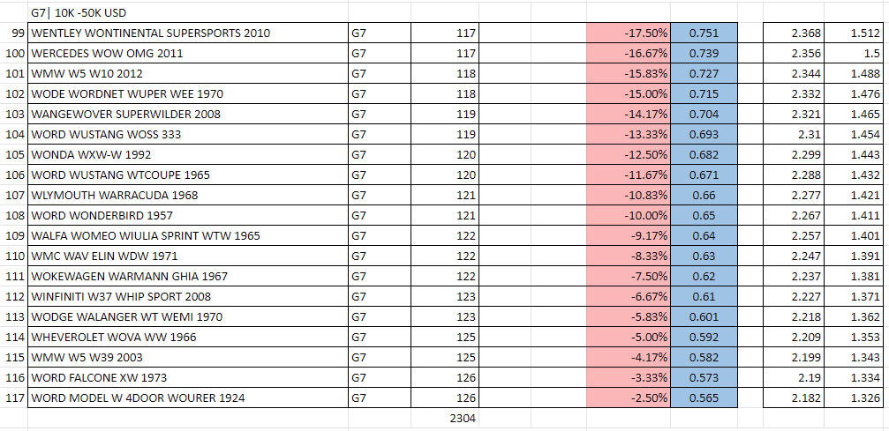
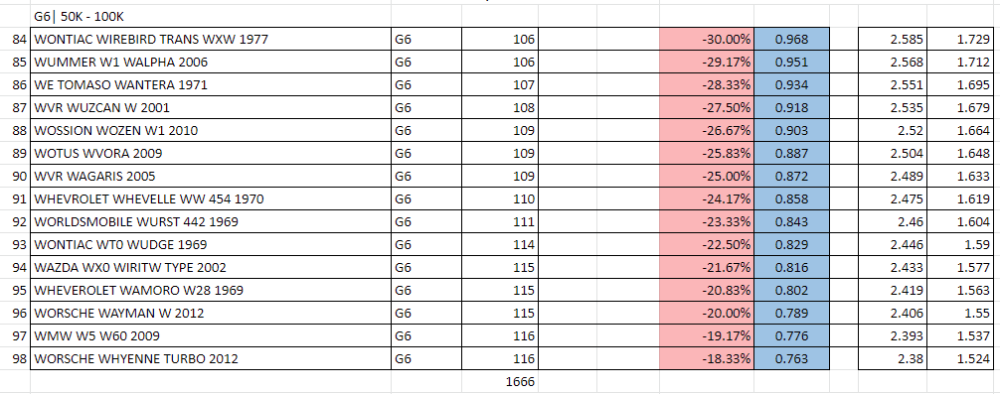
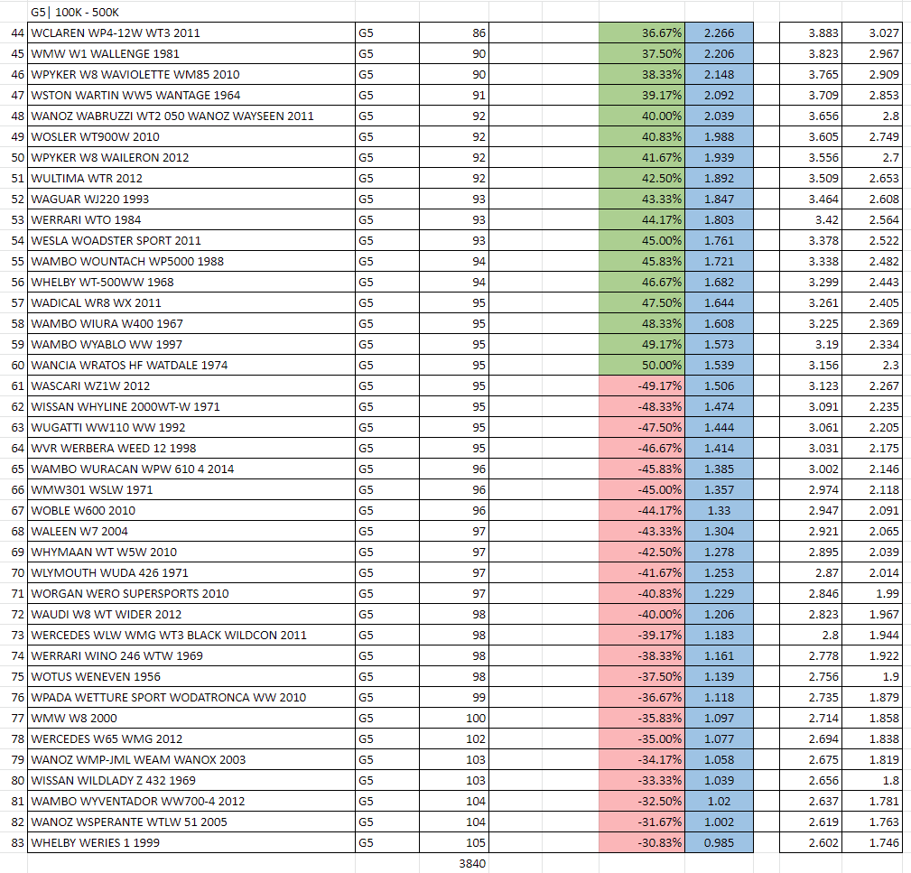
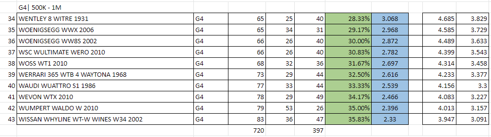
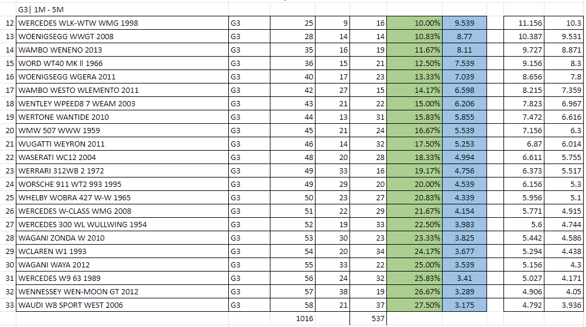
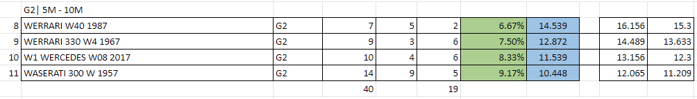
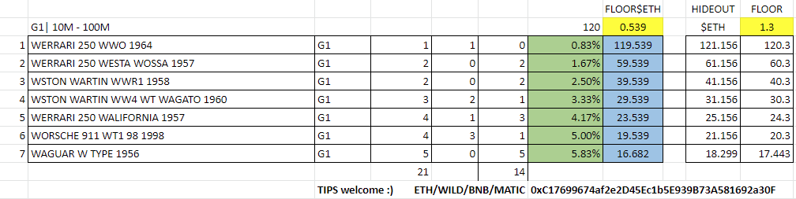

import Bleed from 'nextra-theme-docs/bleed'
import Callout from 'nextra-theme-docs/callout'

# Groups

When wheels were released they were done in groups. A total of 10,101 cars broken up over 8 different groups.
The breakdown of the groups were as follows:

1. Group 8 having **494** wheels
1. Group 7 having **2300** wheels
1. Group 6 having **1670** wheels
1. Group 5 having **3840** wheels
1. Group 4 having **720** wheels
1. Group 3 having **1016** wheels
1. Group 2 having **40** wheels
1. Group 1 having **21** wheels

## Group 8

<Bleed></Bleed>

## Group 7

<Bleed></Bleed>

## Group 6

<Bleed></Bleed>

## Group 5

<Bleed></Bleed>

## Group 4

<Bleed></Bleed>

## Group 3

<Bleed></Bleed>

## Group 2

<Bleed></Bleed>

## Group 1

<Bleed></Bleed>

